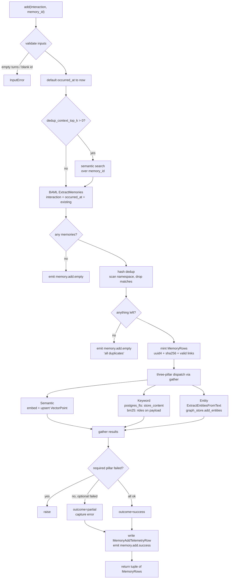
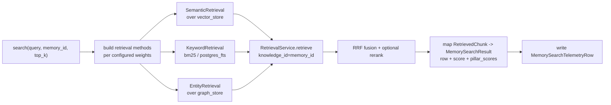

# Memory Engine

`MemoryEngine` is a substrate for building agents that **remember across
conversations**. It takes role-tagged interactions, extracts atomic facts via
an LLM, deduplicates them, and stores them across the same three retrieval
pillars `KnowledgeEngine` already uses — Semantic, Keyword, Entity — scoped to
a consumer-defined `memory_id`.

It is an **engine, not a platform**. It exposes contracts (Protocols, BAML
schemas, dataclasses) and composes existing rfnry-knowledge machinery; it
does not import vendor SDKs, ship a managed REST service, or carry vendor
adapters. The consumer wraps the engine with whatever transport, auth,
multi-tenancy, billing, and provider routing their product needs.

## What it gives you

- **Atomic factual extraction** from conversations with role attribution.
- **Hash-based dedup** to keep the namespace clean as the same fact resurfaces.
- **Semantic recall** scoped to one opaque `memory_id` (consumer's choice — a user, an agent run, a tenant, anything).
- **Optional keyword pillar** (BM25 in-memory or Postgres FTS) and **optional entity pillar** (real graph store with N-hop traversal) when the workload calls for it.
- **In-place mutation** (`update`) and **hard delete**, with full `before` / `after` payloads on observability events as the audit substrate.
- **Telemetry rows** per add / search / update / delete, optionally persisted to Postgres alongside knowledge-side rows.
- **Strict orthogonal namespaces** with `KnowledgeEngine`: same physical Qdrant + Neo4j + Postgres can host both engines without cross-contamination.

---

## Data model

```
Interaction                         ExtractedMemory                MemoryRow
───────────                         ───────────────                ─────────
turns: tuple[InteractionTurn]       text: str                      memory_row_id: str (uuid4)
occurred_at: datetime | None        attributed_to: str | None      memory_id: str
metadata: Mapping                   linked_memory_row_ids: tuple   text: str
                                                                   text_hash: str (sha256)
InteractionTurn                                                    attributed_to: str | None
───────────────                                                    linked_memory_row_ids: tuple
role: str    (opaque label)                                        created_at, updated_at: datetime
content: str                                                       interaction_metadata: Mapping
```

`Interaction` is what the consumer hands in. `ExtractedMemory` is what the
extractor returns (BAML schema). `MemoryRow` is what gets persisted and
returned from `add()` / `search()` / `update()`.

`memory_id` is opaque — the engine never parses it. Consumers use it to scope
per-user, per-agent, per-run, per-tenant, or any combination they want by
encoding it in the string.

---

## The `add()` pipeline



**Key properties:**

- **Hash dedup is unconditional.** Even when `dedup_context_top_k = 0`, every
  add scans the `memory_id` namespace once for matching `text_hash` payloads
  and drops exact duplicates. The semantic dedup-context probe is opt-in and
  affects extraction quality (the LLM sees existing memories and can omit
  near-duplicates or link to them); hash dedup is the safety net.
- **Pillar dispatch is parallel.** Required-pillar failure aborts the add;
  optional-pillar failure flips outcome to `"partial"` and is captured in
  telemetry but does not prevent other pillars from succeeding.
- **`knowledge_id` is aliased to `memory_id` in payloads** so the existing
  `RetrievalService` filter contract works unchanged at search time.

---

## The `search()` pipeline



Search is a **thin wrapper over the existing `RetrievalService`** — the same
fusion code path that powers `KnowledgeEngine.query()`. Per-pillar scores
land in `MemorySearchResult.pillar_scores` so consumers can see why a
memory ranked where it did.

---

## `update()` and `delete()`

Both fetch the current row by `(memory_row_id, memory_id)`, capture the
`before` snapshot, mutate / drop across all three pillars, and emit lifecycle
events with `before` / `after` payloads.

```
update(row_id, new_text, *, memory_id):
  1. fetch before via vector store scroll
  2. re-embed new_text, upsert in place
  3. (postgres_fts) overwrite document store row
  4. (entity) drop prior entities for this row, re-extract, re-add
  5. emit memory.update.success with before+after
  6. write MemoryUpdateTelemetryRow

delete(row_id, *, memory_id):
  1. fetch before
  2. delete from vector store, document store, graph store (cascading)
  3. emit memory.delete.success with before
  4. write MemoryDeleteTelemetryRow
```

The `before` / `after` event payloads are **the audit substrate** — consumers
who need an append-only audit log sink the events into their own table and
never call `delete` themselves.

---

## Configuration shape

```python
MemoryEngineConfig(
    ingestion=MemoryIngestionConfig(
        extractor=DefaultMemoryExtractor(provider_client=anthropic_client),
        embeddings=MyOpenAIEmbeddings(...),
        vector_store=QdrantVectorStore(url=..., collection="memory"),

        # optional pillars — wire only what you need
        document_store=PostgresDocumentStore(url=..., table_name="memory_fts"),
        graph_store=Neo4jGraphStore(uri=..., password=..., node_label_prefix="Memory"),
        entity_provider=anthropic_client,
        entity_extraction=EntityIngestionConfig(...),

        # tunables
        keyword_backend="bm25",      # or "postgres_fts"
        dedup_context_top_k=5,       # 0 disables semantic dedup probe
        semantic_required=True,
        keyword_required=False,
        entity_required=False,
    ),
    retrieval=MemoryRetrievalConfig(
        semantic_weight=0.5,
        keyword_weight=0.3,
        entity_weight=0.2,
        rerank=MyReranker(...),      # optional
    ),
    metadata_store=SQLAlchemyMetadataStore(url=...),  # optional, for telemetry
)
```

`vector_store`, `document_store`, `graph_store`, and `entity_provider` live
on `MemoryIngestionConfig` — same shape as `KnowledgeEngine`, where each
ingestion method owns its own store and provider. This makes it explicit
that a consumer can use different stores or different providers per pillar.

---

## Storage namespacing

Memory and knowledge engines are **fully orthogonal namespaces**. They can
share the same physical Qdrant + Postgres + Neo4j cluster as long as the
collection / table / label names are disjoint:

| Backend  | Knob                         | Memory passes        |
|----------|------------------------------|----------------------|
| Qdrant   | `collection`                 | `"memory"`           |
| Postgres | `table_name`                 | `"memory_fts"`       |
| Neo4j    | `node_label_prefix`          | `"Memory"`           |

Search results never mix the two engines; the SDK ships no fused-search
escape hatch. Consumers who want both compose them client-side.

---

## When to use this engine

- You are building an agent product that needs **persistent recall** across
  conversations, runs, sessions, or tenants.
- You already use rfnry-knowledge for RAG and want a **memory layer that
  composes** with the same stores, providers, observability, and telemetry.
- You want **one Protocol surface** for both knowledge and memory so a single
  consumer impl set covers everything.
- You want to **own the transport, auth, and product wrapper** — multi-tenancy,
  billing, soft-delete policy, decay rules, audit retention — and run the
  engine inside a regulated environment where every wire is yours.
