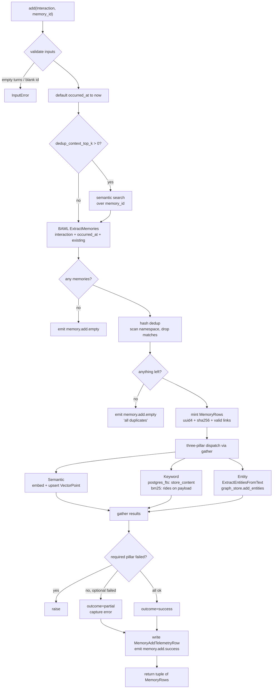
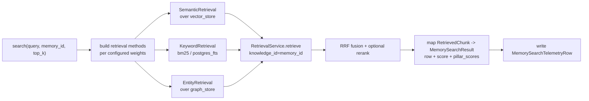

# Memory Engine

`MemoryEngine` is a substrate for building agents that **remember across
conversations**. It takes role-tagged interactions, extracts atomic facts via
an LLM, deduplicates them, and stores them across the same three retrieval
pillars `KnowledgeEngine` already uses — Semantic, Keyword, Entity — scoped to
a consumer-defined `memory_id`.

It is an **engine, not a platform**. It exposes contracts (Protocols, BAML
schemas, dataclasses) and composes existing rfnry-knowledge machinery; it
does not import vendor SDKs, ship a managed REST service, or carry vendor
adapters. The consumer wraps the engine with whatever transport, auth,
multi-tenancy, billing, and provider routing their product needs.

## What it gives you

- **Atomic factual extraction** from conversations with role attribution.
- **Hash-based dedup** to keep the namespace clean as the same fact resurfaces.
- **Semantic recall** scoped to one opaque `memory_id` (consumer's choice — a user, an agent run, a tenant, anything).
- **Optional keyword pillar** (BM25 in-memory or Postgres FTS) and **optional entity pillar** (real graph store with N-hop traversal) when the workload calls for it.
- **In-place mutation** (`update`) and **hard delete**, with full `before` / `after` payloads on observability events as the audit substrate.
- **Telemetry rows** per add / search / update / delete, optionally persisted to Postgres alongside knowledge-side rows.
- **Strict orthogonal namespaces** with `KnowledgeEngine`: same physical Qdrant + Neo4j + Postgres can host both engines without cross-contamination.

---

## Data model

```
Interaction                         ExtractedMemory                MemoryRow
───────────                         ───────────────                ─────────
turns: tuple[InteractionTurn]       text: str                      memory_row_id: str (uuid4)
occurred_at: datetime | None        attributed_to: str | None      memory_id: str
metadata: Mapping                   linked_memory_row_ids: tuple   text: str
                                                                   text_hash: str (sha256)
InteractionTurn                                                    attributed_to: str | None
───────────────                                                    linked_memory_row_ids: tuple
role: str    (opaque label)                                        created_at, updated_at: datetime
content: str                                                       interaction_metadata: Mapping
```

`Interaction` is what the consumer hands in. `ExtractedMemory` is what the
extractor returns (BAML schema). `MemoryRow` is what gets persisted and
returned from `add()` / `search()` / `update()`.

`memory_id` is opaque — the engine never parses it. Consumers use it to scope
per-user, per-agent, per-run, per-tenant, or any combination they want by
encoding it in the string.

---

## The `add()` pipeline



**Key properties:**

- **Hash dedup is unconditional.** Even when `dedup_context_top_k = 0`, every
  add scans the `memory_id` namespace once for matching `text_hash` payloads
  and drops exact duplicates. The semantic dedup-context probe is opt-in and
  affects extraction quality (the LLM sees existing memories and can omit
  near-duplicates or link to them); hash dedup is the safety net.
- **Pillar dispatch is parallel.** Required-pillar failure aborts the add;
  optional-pillar failure flips outcome to `"partial"` and is captured in
  telemetry but does not prevent other pillars from succeeding.
- **`knowledge_id` is aliased to `memory_id` in payloads** so the existing
  `RetrievalService` filter contract works unchanged at search time.

---

## The `search()` pipeline



Search is a **thin wrapper over the existing `RetrievalService`** — the same
fusion code path that powers `KnowledgeEngine.query()`. Per-pillar scores
land in `MemorySearchResult.pillar_scores` so consumers can see why a
memory ranked where it did.

---

## `update()` and `delete()`

Both fetch the current row by `(memory_row_id, memory_id)`, capture the
`before` snapshot, mutate / drop across all three pillars, and emit lifecycle
events with `before` / `after` payloads.

```
update(row_id, new_text, *, memory_id):
  1. fetch before via vector store scroll
  2. re-embed new_text, upsert in place
  3. (postgres_fts) overwrite document store row
  4. (entity) drop prior entities for this row, re-extract, re-add
  5. emit memory.update.success with before+after
  6. write MemoryUpdateTelemetryRow

delete(row_id, *, memory_id):
  1. fetch before
  2. delete from vector store, document store, graph store (cascading)
  3. emit memory.delete.success with before
  4. write MemoryDeleteTelemetryRow
```

The `before` / `after` event payloads are **the audit substrate** — consumers
who need an append-only audit log sink the events into their own table and
never call `delete` themselves.

---

## Configuration shape

```python
MemoryEngineConfig(
    ingestion=MemoryIngestionConfig(
        extractor=DefaultMemoryExtractor(provider_client=anthropic_client),
        embeddings=MyOpenAIEmbeddings(...),
        vector_store=QdrantVectorStore(url=..., collection="memory"),

        # optional pillars — wire only what you need
        document_store=PostgresDocumentStore(url=..., table_name="memory_fts"),
        graph_store=Neo4jGraphStore(uri=..., password=..., node_label_prefix="Memory"),
        entity_provider=anthropic_client,
        entity_extraction=EntityIngestionConfig(...),

        # tunables
        keyword_backend="bm25",      # or "postgres_fts"
        dedup_context_top_k=5,       # 0 disables semantic dedup probe
        semantic_required=True,
        keyword_required=False,
        entity_required=False,
    ),
    retrieval=MemoryRetrievalConfig(
        semantic_weight=0.5,
        keyword_weight=0.3,
        entity_weight=0.2,
        rerank=MyReranker(...),      # optional
    ),
    metadata_store=SQLAlchemyMetadataStore(url=...),  # optional, for telemetry
)
```

`vector_store`, `document_store`, `graph_store`, and `entity_provider` live
on `MemoryIngestionConfig` — same shape as `KnowledgeEngine`, where each
ingestion method owns its own store and provider. This makes it explicit
that a consumer can use different stores or different providers per pillar.

---

## Storage namespacing

Memory and knowledge engines are **fully orthogonal namespaces**. They can
share the same physical Qdrant + Postgres + Neo4j cluster as long as the
collection / table / label names are disjoint:

| Backend  | Knob                         | Memory passes        |
|----------|------------------------------|----------------------|
| Qdrant   | `collection`                 | `"memory"`           |
| Postgres | `table_name`                 | `"memory_fts"`       |
| Neo4j    | `node_label_prefix`          | `"Memory"`           |

Search results never mix the two engines; the SDK ships no fused-search
escape hatch. Consumers who want both compose them client-side.

---

## Comparison with mem0

mem0 is the reference implementation we drew from. It is a venture-backed
company shipping a managed memory platform. We ship an engine. The two
overlap on the algorithm and diverge sharply on everything else.

### What mem0 ships

| Surface                              | What it is                                                                   |
|--------------------------------------|------------------------------------------------------------------------------|
| `mem0/memory/main.py` (~3.2k LOC)    | Sync + async `Memory` class with `add` / `search` / `get` / `update` / `delete` / `history` / `reset` / `chat` |
| `mem0/llms/`                         | 17 vendor LLM adapters (Anthropic, OpenAI, Bedrock, Gemini, Groq, Together, vLLM, …) |
| `mem0/embeddings/`                   | 12 vendor embedding adapters                                                 |
| `mem0/vector_stores/`                | 24 vector store adapters                                                     |
| `mem0/client/`                       | REST/HTTP client for the **managed Mem0 Platform** (api.mem0.ai)             |
| `mem0/proxy/`                        | OpenAI-compatible drop-in proxy                                              |
| `server/`                            | FastAPI server packaging                                                     |
| `openmemory/`                        | "OpenMemory" product wrapper                                                 |
| Procedural memory branch              | Special path for summarising agent traces                                    |
| Multiple memory types                 | semantic / episodic / procedural enums                                       |
| SQLite mutation history               | Per-row history table (`history()` API)                                      |
| Telemetry → posthog                   | Anonymous usage capture to mem0's telemetry pipeline                         |
| Entity layer                          | Second flat vector collection (`entity_store`); they removed the graph store in v3 |
| `vision_messages` parsing             | Auto-extract from image messages                                             |
| `infer=False` raw-mode add            | Skip extraction, store messages verbatim                                     |
| Filter DSL                            | `eq`, `ne`, `in`, `gt`, `contains`, `AND`/`OR`/`NOT`                         |

### What we ship

| Surface                                            | What it is                                                                   |
|----------------------------------------------------|------------------------------------------------------------------------------|
| `rfnry_knowledge.memory/` (~640 LOC)               | `MemoryEngine`, `BaseExtractor` Protocol, `DefaultMemoryExtractor`, dataclasses |
| One BAML function (`ExtractMemories`)              | ~40-line lean prompt; consumer-overridable via `BaseExtractor`               |
| Reused three pillars                               | `SemanticRetrieval` / `KeywordRetrieval` / `EntityRetrieval` from KnowledgeEngine — *real* `BaseGraphStore` (Neo4j) with N-hop traversal, not a flat-vector regression |
| Reused `RetrievalService`                          | RRF fusion + optional rerank, identical to knowledge-side                    |
| Reused stores                                      | `QdrantVectorStore`, `PostgresDocumentStore`, `Neo4jGraphStore`, `SQLAlchemyMetadataStore` — provider-agnostic Protocols |
| Reused observability + telemetry                   | `Observability` events with `before` / `after` audit payloads, `Telemetry` rows persisted to Postgres |

That is the entire surface. ~640 lines of memory-specific code on top of
machinery that already existed for the knowledge engine.

### Where the gap is real and we keep it

These are mem0 capabilities we deliberately do **not** ship, and the reasoning:

| mem0 feature                                  | Why we don't ship it                                                                                            |
|-----------------------------------------------|-----------------------------------------------------------------------------------------------------------------|
| 17 LLM + 12 embedding + 24 vector store adapters | Provider-agnostic invariant. Consumers plug in via `BaseEmbeddings` / `BaseReranking` / `ProviderClient`. BAML covers the LLM side. |
| Managed REST platform (`api.mem0.ai`)         | We are an SDK. Transport is the consumer's product surface.                                                      |
| OpenAI-compatible proxy                       | Same — transport.                                                                                                |
| FastAPI server packaging                      | Same — transport. The therapy-assistant and operation-assistant examples show how trivial it is on top.          |
| `mem0/openmemory` product wrapper             | Wrapper, not engine.                                                                                             |
| Multiple memory types (semantic/episodic/procedural) | Engine, not framework. Consumer encodes the distinction in `interaction_metadata` if they want it.        |
| Procedural memory branch                      | Same. A consumer that wants to summarise an agent trace formats it as an `Interaction` with whatever role label fits. |
| `vision_messages` parsing                     | Multimodal input is a consumer concern. The extractor sees text — consumers convert images upstream.             |
| `infer=False` raw-mode add                    | Consumer writes one line of code: `memory.add(Interaction(turns=(InteractionTurn("trace", text),)), memory_id=...)` — no extraction toggle needed; ship a NoOpExtractor or a passthrough one. |
| Filter DSL                                     | The vector-store filter contract is what we expose; complex filters are the consumer's product layer.            |
| SQLite mutation history                       | Same substrate via `Observability` events + `Telemetry` rows. Consumer sinks to wherever they want.              |
| posthog telemetry                              | Strictly opt-in observability is the rfnry-knowledge default. We don't phone home.                               |
| Decay / TTL / auto-merge                      | Policy belongs in the consumer. The engine does not have an opinion on how long a memory should live.            |
| `purge(memory_id)` / bulk ops                 | YAGNI for v1. The consumer can iterate `delete()` if they need it.                                               |
| `chat(query)`                                 | We don't bundle generation with memory. Knowledge has it because RAG implies generation; memory does not. The therapy-assistant example shows the wiring is ~10 lines. |

### Where the gap closes naturally

These are mem0 features that **the consumer can build on top of our engine
in tens of lines**, not hundreds:

- **OpenAI-compatible chat proxy** — wrap `MemoryEngine.search` + your LLM SDK in a FastAPI endpoint. See `examples/knowledge/therapy-assistant`.
- **Per-tenant scoping** — encode the tenant in `memory_id` (`"tenant:42:user:alice"`). The engine is a pass-through.
- **Soft delete / append-only audit** — sink `memory.update.success` and `memory.delete.success` events into a consumer-owned table and never call `delete()`.
- **Memory types** — pass `interaction_metadata={"memory_type": "episodic"}`. The payload propagates and is filterable.
- **Multi-provider routing** — supply your own `BaseExtractor` impl that picks providers per request (cost / latency / fallback). Ours is BAML-routed; you can replace the whole class.
- **Decay / TTL** — periodic job that scans `MemoryRow.created_at` and calls `delete()`. Can be a cron in your product.
- **Procedural / agent-trace memories** — render the trace as text, format it as one `InteractionTurn` with role `"trace"`, call `add()`. The default extractor handles it; or supply a domain-specific extractor.
- **History API (`history(memory_row_id)`)** — sink the lifecycle events to a table keyed by `memory_row_id`. One indexed query.
- **Bulk purge** — application-level `for row in list_by_memory_id(...): await memory.delete(...)`.

### Where mem0 is genuinely ahead today

To be honest: mem0 has invested in a few things we deliberately don't.

- **Adapter coverage.** They support 24 vector stores out of the box. We support Qdrant. If a consumer is locked into Pinecone, Milvus, or Weaviate, they write a `BaseVectorStore` Protocol impl (~150 lines) before they can use the engine.
- **Filter operator DSL.** Their search filters take `eq` / `gt` / `AND` / `OR` etc. Ours forwards a flat dict to the vector store. Most workloads don't need it; some do.
- **Procedural-memory specialised prompt.** Their summarise-an-agent-trace path has its own prompt template. Ours doesn't — the consumer crafts the trace text or supplies a domain extractor.
- **Public benchmarks against LoCoMo / similar.** They publish numbers; we don't ship an evaluation harness for memory-side recall (knowledge-side has one, memory-side is consumer-tested).
- **Maturity and community.** They have stars, issues, integrations, vendor-team relationships. We have an internal SDK.

### Where we are genuinely ahead

- **Real graph layer.** mem0 v3 ripped out their graph store and replaced it
  with a flat-vector "entity_store" plus a similarity-boost trick. We kept
  the real `BaseGraphStore` Protocol (Neo4j default) with N-hop traversal
  and `memory_id`-scoped subgraphs. For workloads that need typed, traversable
  relationships between memories, the gap is structural.
- **Provider-agnostic invariant.** Our package imports zero vendor SDKs.
  Memory rides on the same Protocol surface as knowledge — consumers bring
  one set of impls and both engines compose. mem0's LLM/embedding/vector-store
  matrix is hard-coded vendor adapters with config dictionaries.
- **One pillar implementation, two engines.** `SemanticRetrieval` / `KeywordRetrieval` / `EntityRetrieval` and `RetrievalService` are shared between knowledge and memory. Bug fixes, fusion improvements, reranking — all done once.
- **Strict orthogonal namespaces.** A consumer running both engines on the
  same physical infrastructure has hard isolation guarantees: separate
  Qdrant collections, separate Postgres tables, prefixed Neo4j labels.
  Search results never mix.
- **Audit substrate, not audit feature.** `update` / `delete` events ship
  `before` and `after` payloads as first-class fields, designed to be sunk.
  Consumers that need an append-only audit log get it for free; consumers
  that don't pay nothing.

### Can both achieve a similar result?

Yes — for the **memory algorithm itself**: extract atomic facts, dedup, store
across vector + lexical + entity, recall with fusion, mutate in place. The
algorithms are equivalent because both took the same shape from the
literature.

The **product surface** diverges by design. mem0 is shipping a managed
platform; we are shipping an engine. A consumer who wants the managed-platform
ergonomics can wrap us; a consumer who wants the engine flexibility cannot
unwrap mem0 without forking it.

We are happy with that trade. The engine survives model improvements;
adapter matrices and managed-platform ergonomics decay with every new
provider, every new vector store, every new chat model. We optimise for
the substrate that compounds.

---

## When to use this engine

- You are building an agent product that needs **persistent recall** across
  conversations, runs, sessions, or tenants.
- You already use rfnry-knowledge for RAG and want a **memory layer that
  composes** with the same stores, providers, observability, and telemetry.
- You want **one Protocol surface** for both knowledge and memory so a single
  consumer impl set covers everything.
- You want to **own the transport, auth, and product wrapper** — multi-tenancy,
  billing, soft-delete policy, decay rules, audit retention — instead of
  inheriting opinionated defaults from a managed platform.

If you want a managed memory platform with a hosted API, OpenAI-compatible
proxy, vendor-adapter matrix, and posthog telemetry — use mem0. That is
exactly what they ship and they ship it well.

If you want a **lean engine you can wrap** with the product you have in mind,
including running it inside a regulated environment where every wire is
yours — that is what `MemoryEngine` is for.
